# Cybersecurity Attack Simulation, Defense, and Security Monitoring Lab
> A hands-on cybersecurity lab demonstrating attack simulation, detection, and defense using the ELK Stack.

## 📚 Table of Contents
- Overview
- Scope
- Objectives
- Technologies Used
- Tool Roles
- Lab Setup
- Network Architecture
- Attack Simulation
- Detection and Monitoring
- Defense and Mitigation
- Project Structure
- Incident Report
- Key Lessons Learned
- Conclusion
- Skills Demonstrated

---

## 📌 Overview
This project demonstrates a simulated cybersecurity environment designed to analyze, detect, and mitigate real-world cyber threats. It integrates offensive and defensive techniques with centralized monitoring using the ELK Stack.

> The lab simulates an attacker (Kali Linux) targeting a vulnerable server while security tools detect and respond to the activity.

---

## 🧭 Scope
This lab covers both **network-based attacks** and **web application vulnerabilities**, integrating attack simulation, detection, and defensive mechanisms within a controlled environment.

---

## 🎯 Objectives
- Simulate real-world cyberattacks
- Monitor malicious activities
- Implement defensive security controls
- Analyze logs using a SIEM (ELK Stack)
- Understand attack patterns and mitigation strategies

---

## 🛠️ Technologies Used
- Kali Linux  
- Ubuntu Server  
- DVWA  
- Cowrie Honeypot  
- Apache HTTP Server  
- ELK Stack  
- Filebeat  
- UFW  
- ModSecurity  

---

## ▶️ How to Reproduce (Summary)
1. Deploy Ubuntu Server with Apache and DVWA
2. Configure Cowrie honeypot on port 2222
3. Install and configure ELK Stack and Filebeat
4. Launch attacks from Kali Linux (Nmap, Metasploit, DVWA payloads)
5. Monitor logs in Kibana dashboard

---

## 🔗 Tool Roles

- **Kali Linux** → Attack simulation  
- **DVWA** → Web vulnerability testing  
- **Cowrie** → SSH honeypot logging  
- **ELK Stack** → Log analysis and visualization (SIEM)  
- **Filebeat** → Log forwarding  
- **UFW** → Network-level defense  
- **ModSecurity** → Web application firewall  

---

## 🧪 Lab Setup

### DVWA Deployment

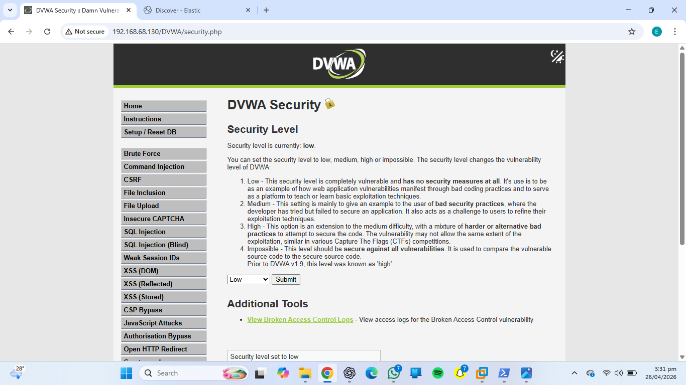
*DVWA successfully deployed on the target server*

---

### Cowrie Honeypot Deployment

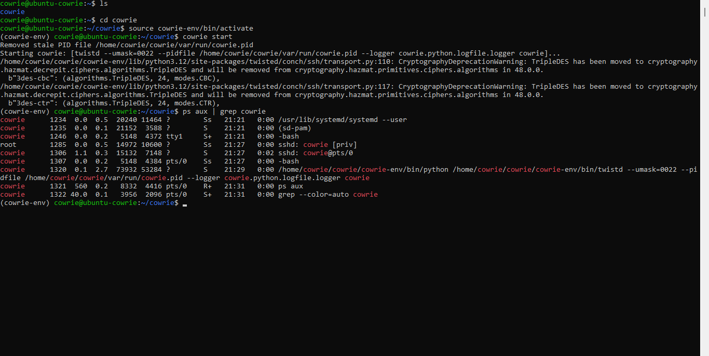
*Cowrie SSH honeypot running on port 2222*

---

## 🏗️ Network Architecture
📄 [View Network Diagram](architecture/network-diagram.pdf)

---

## ⚔️ Attack Simulation

### 🔍 Network Reconnaissance (Nmap)

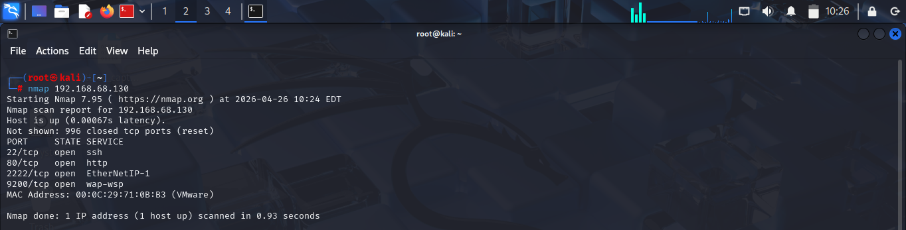
*Nmap scan showing open ports before firewall configuration*

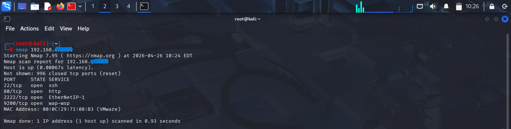
*Nmap scan showing reduced ports after firewall configuration*

---

### 🔐 SSH Brute Force Attack (Metasploit)

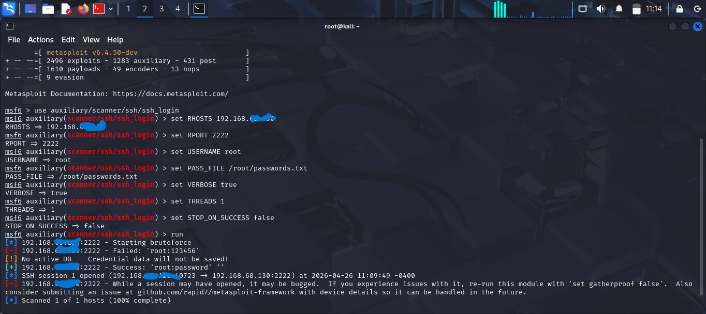
*Brute-force attack captured by Cowrie honeypot*

---

### 🌐 Web Application Attacks (DVWA)

#### SQL Injection

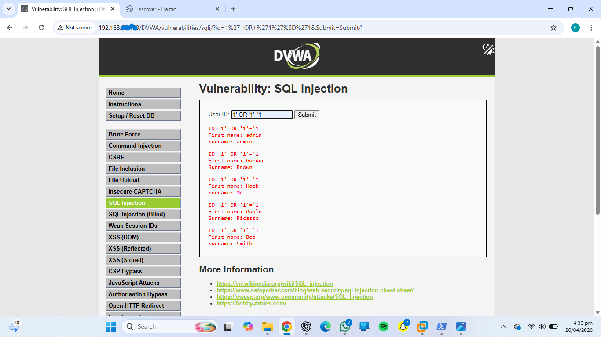
*Authentication bypass using SQL injection*

#### Cross-Site Scripting (XSS)

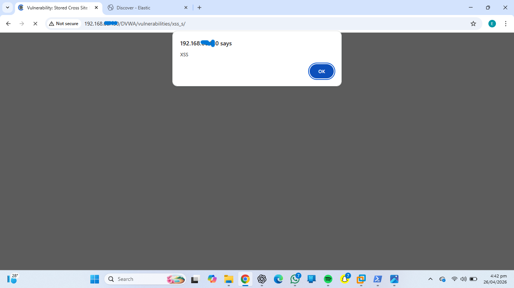
*Execution of malicious JavaScript via XSS vulnerability*

---

## 📊 Detection and Monitoring

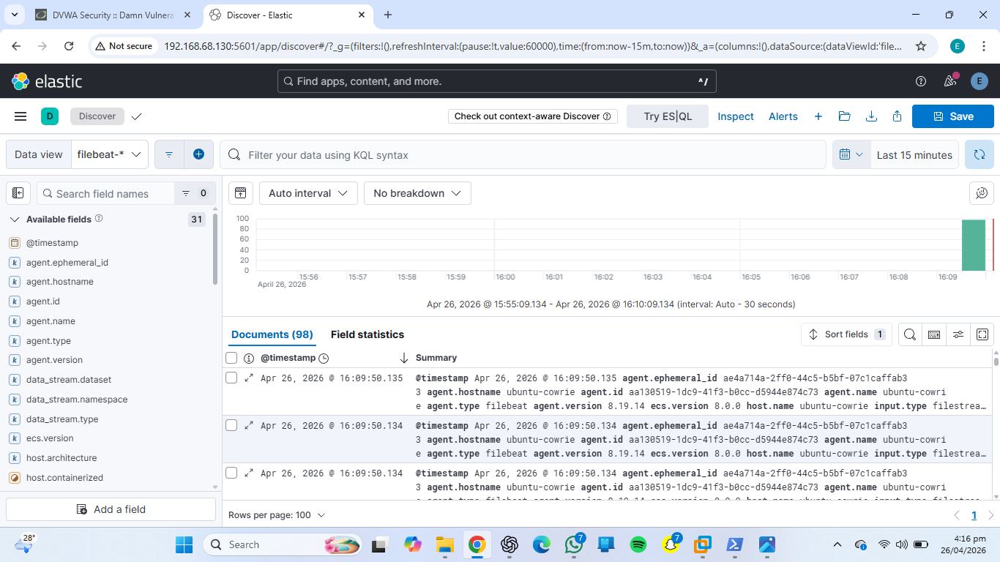
*Kibana dashboard showing captured attack logs*

> Centralized log analysis enabled real-time visibility into reconnaissance, brute-force attempts, and web attacks.

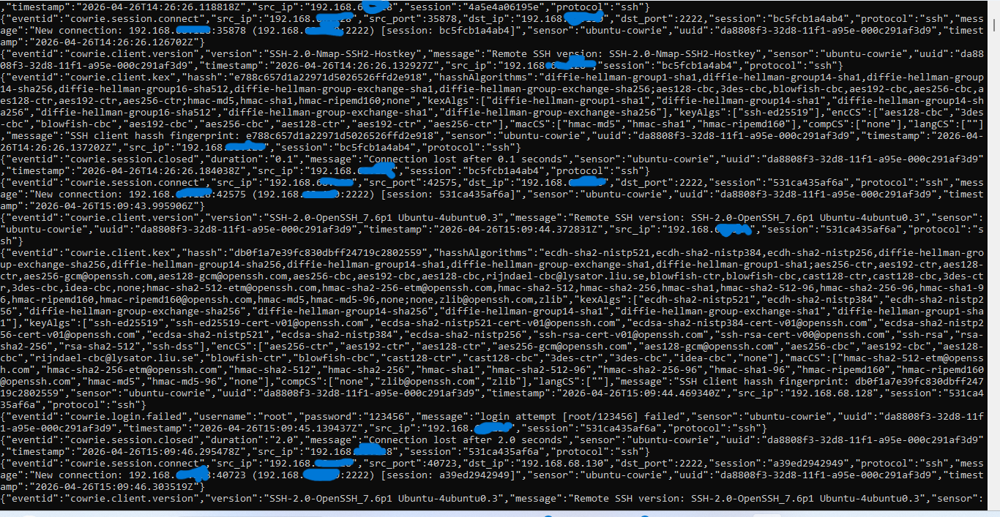
*Captured SSH brute-force attempts*

---

## 🛡️ Defense and Mitigation

### 🔒 Firewall (UFW)

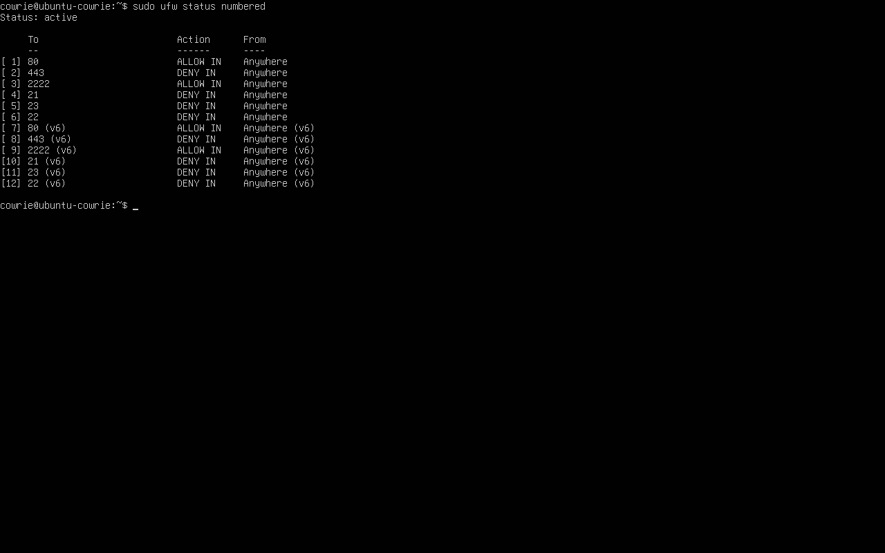
*Firewall rules restricting access*

---

### 🧱 Web Application Firewall (ModSecurity)

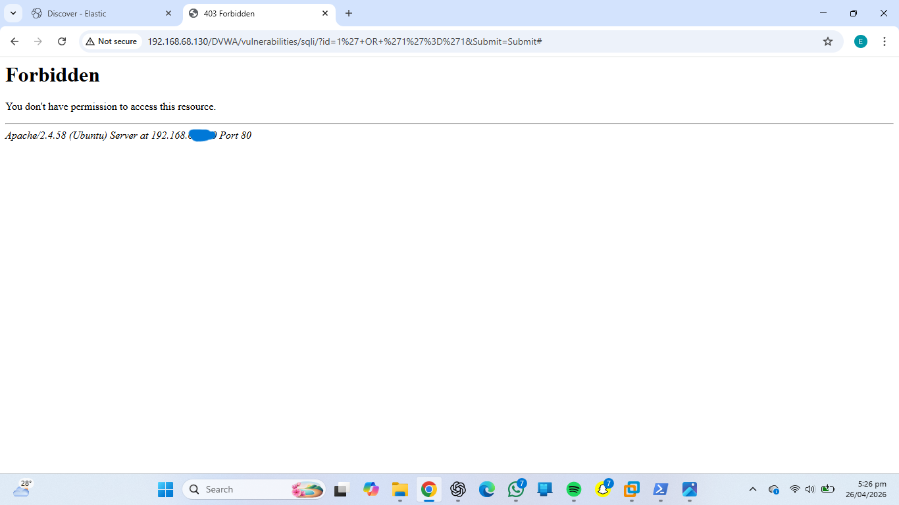
*SQL injection blocked*

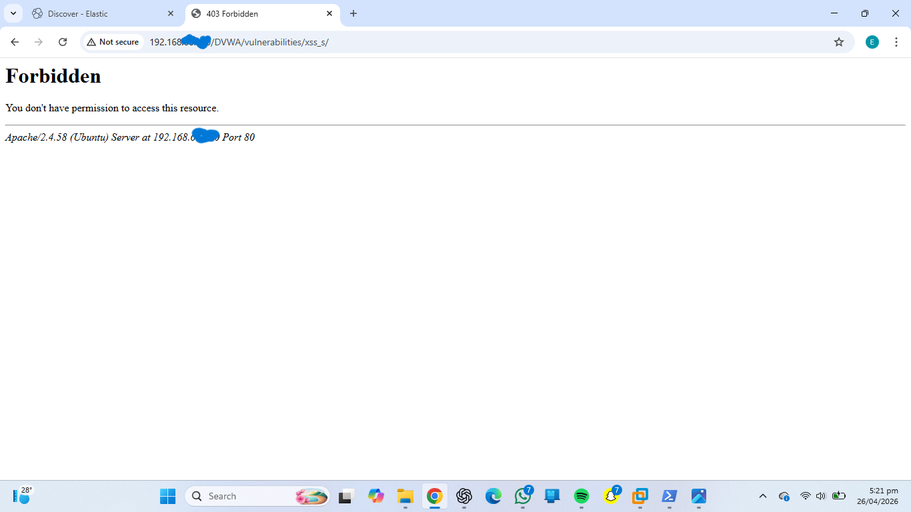
*XSS attack detected and blocked*

---

## 📁 Project Structure
```
cyber-attack-simulation-lab/
│
├── README.md
│
├── report/
│   └── incident-report.pdf
│
├── screenshots/
│   ├── dvwa-deployed.png
│   ├── honeypot-deployed.png
│   ├── nmap-before.png
│   ├── nmap-after.png
│   ├── metasploit.png
│   ├── sqli.png
│   ├── xss.png
│   ├── elk-dashboard.png
│   ├── cowrie-logs.png
│   ├── ufw.png
│   ├── modsecurity-sqli.png
│   └── modsecurity-xss.png
│
├── architecture/
│   └── network-diagram.pdf
│
└── configs/
```

---

## 📑 Incident Report
📄 [View Report](report/incident-report.pdf)

---

## 🧠 Key Lessons Learned
- Open ports are major attack entry points  
- Weak input validation leads to vulnerabilities  
- SSH services are common brute-force targets  
- Defense-in-depth is critical  
- Continuous monitoring is essential  

---

## ✅ Conclusion
This project demonstrates a full cybersecurity workflow:
- Attack simulation  
- Detection using ELK Stack  
- Mitigation using firewall and WAF  

> It reflects real-world Security Operations Center (SOC) practices for threat detection and response.

---

## 🧠 Skills Demonstrated
- SIEM implementation (ELK Stack)
- Network reconnaissance and analysis
- Web application security testing (SQLi, XSS)
- Intrusion detection and log analysis
- Security hardening (Firewall & WAF)

---

## 👨‍💻 Author
**Eseigbe Ihinosen Idialu**

---

## 📜 License
MIT License